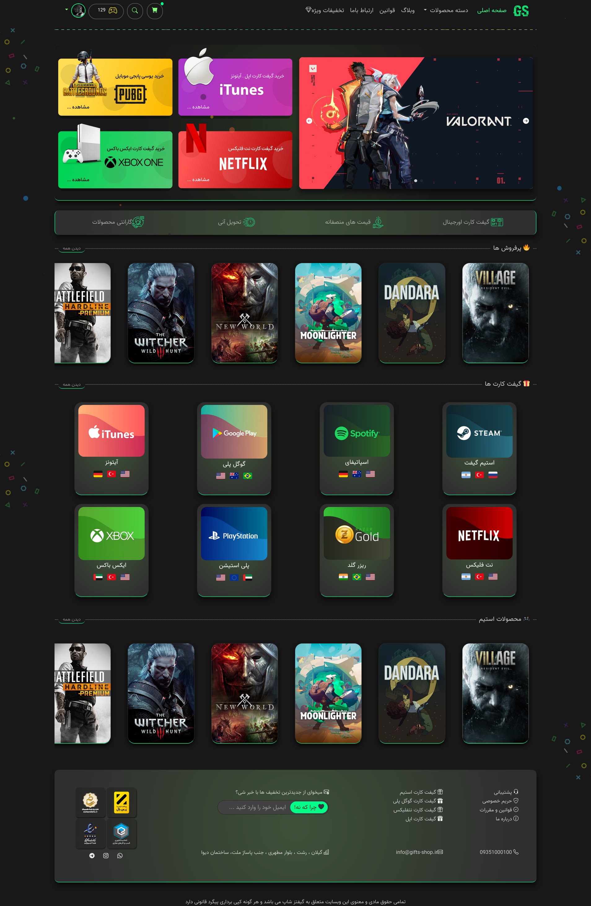

[](https://en.wikipedia.org/wiki/MIT_License)
[](https://www.postgresql.org)

## ⚠️️ The project is under development and not completed! ⚠️

### Gift Card Shop - فروشگاه گیفت کارت

Django - Bootstrap ❤️

### Demo
 

### Setup

The first thing to do is to clone the repository:

```sh
➜  ~ git clone https://github.com/0x73am43l/Gifts-Shop-fa.git
➜  ~ cd Gifts-Shop-fa
```

Create a virtual environment to install dependencies in and activate it:

```sh
➜  Gifts-Shop-fa ~ virtualenv -p python3 .env
➜  Gifts-Shop-fa ~ source .env/bin/activate
```

Then install the dependencies:

```sh
(.env) ➜  Gifts-Shop-fa ~ pip install -r requirements.txt
```
Note the `(.env)` in front of the prompt. This indicates that this terminal
session operates in a virtual environment set up by `virtualenv`.

Once `pip` has finished downloading the dependencies:
```sh
(.env) ➜  Gifts-Shop-fa ~ cd project
(.env) ➜  Gifts-Shop-fa ~ python manage.py runserver
```
And navigate to `http://127.0.0.1:8000`.


### Features :


* SEO friendly
* Phone Number & Email Login/Register
* Custom Admin Panel
* Asynchronous
* Automate Send Gift for Client

More information on `our website <http://127.0.0.1:8000>`.


### Todo :

* none